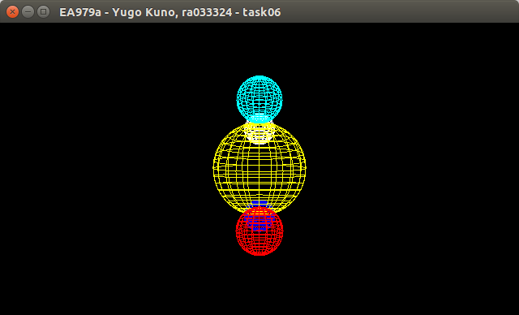
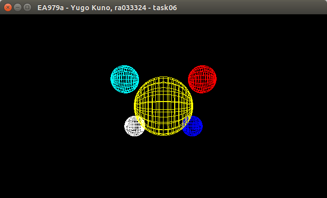
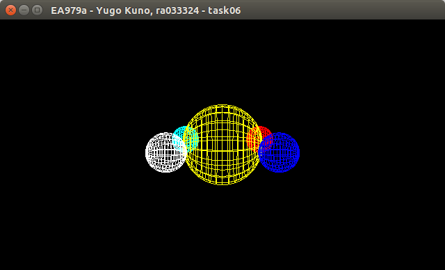
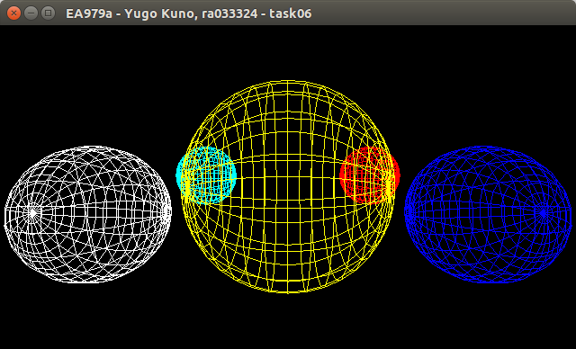
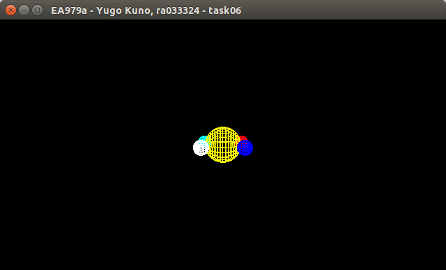
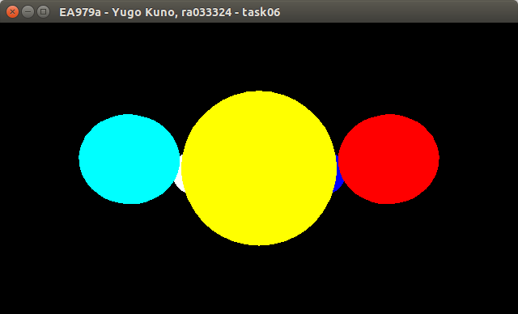
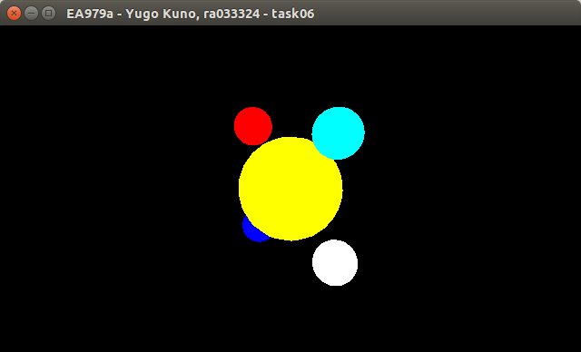
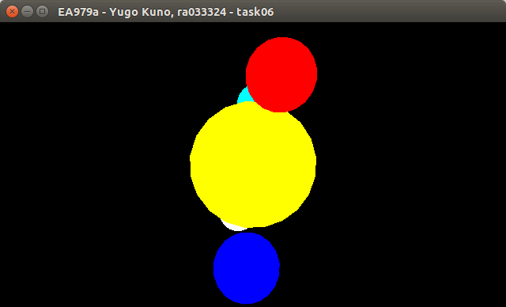
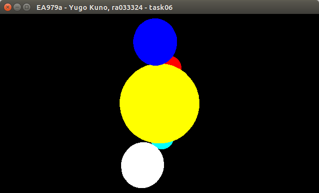
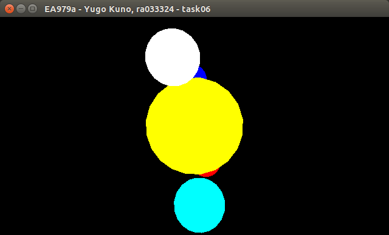

##### 2016s1 - EA979a
##### 033324 - Yugo Kuno
#### Atividade 06: CG/introdução ao opengl

---

### Funcionamento do programa

- Inicializa o GLUT, configura janela, etc.
- Configura a visualização correta de objetos conforme profundidade no campo de visão.
- Define parâmetros iniciais de perspectiva.
- Define a _display callback function_:
  - Configura a perspectiva.
  - Limpa o frame anterior com novo _background_.
  - Desenha as cinco esferas, para cada uma:
    - Adiciona matriz para posição da esfera.
    - Rotaciona e translada a matriz conforme desejado.
    - Desenha _WireSphere_ ou _SolidSphere_ conforme desejado.
    - Remove matriz de posição não mais necessária.
  - Manda o buffer criado para ser mostrado na janela.
- Define a _reshape callback function_:
  - Configura o _Viewport_ e ajusta a perspectiva para o formato atual da janela.
- Define a _keyboard callback function_:
  - Configura os parâmetros de visualização definidos na _global struct variable_ `perspective` conforme input do teclado.
- Mantém o programa rodando e respondendo aos _callbacks_ acima enquanto a janela estiver aberta.

### Lista de comandos

- Os inputs `x`, `y` e `z` rotacionam a cena nos respectivos eixos; `X`, `Y` e `Z` fazem as rotações inversas respectivas.
- `+` aproxima a cena, `-` afasta.
- `w` alterna o tipo das esferas entre _WireSphere_ e _SolidSphere_.
- `r` reinicializa a cena para a configuração original.

### Imagens de exemplo do programa

